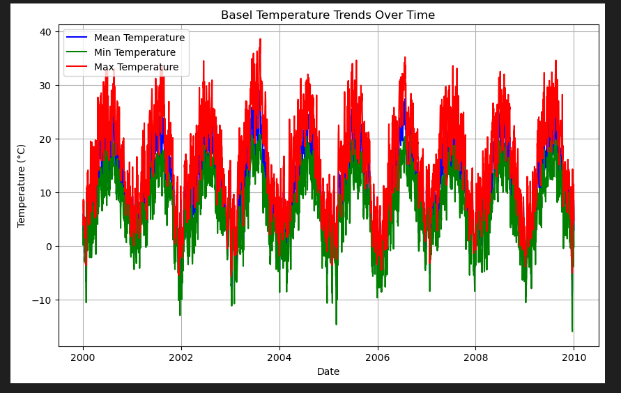
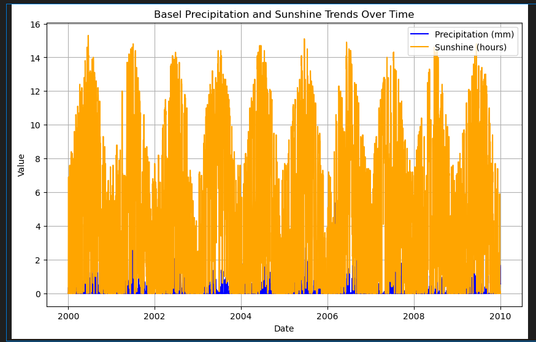
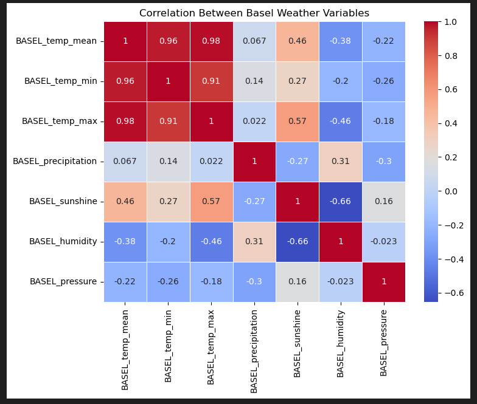

# Data-Viz-Weather

## Requirements

        pip install pandas matplotlib seaborn

## Description 
The following is a demonstration of using Python and its libraries for Data Visualization. The visualizations have been generated using the weather Data for Basel only.

### 1. Temperature Trends:
A line plot showing the mean, minimum and maximum temperature trends over time in Basel.

### 2. Precipitation and Sunshine Trends:
A combined line plot for precipitation (mm) and sunshing (hours) trends over time in Basel.

### 3. Correlation Heatmap:
A display of a heatmap showing the correlation between between various Basel weather variables. (Temperature Precipitation, Sunshine, Wind Speed, Humidity). The closer the value is to 1, the stronger the correlation.

